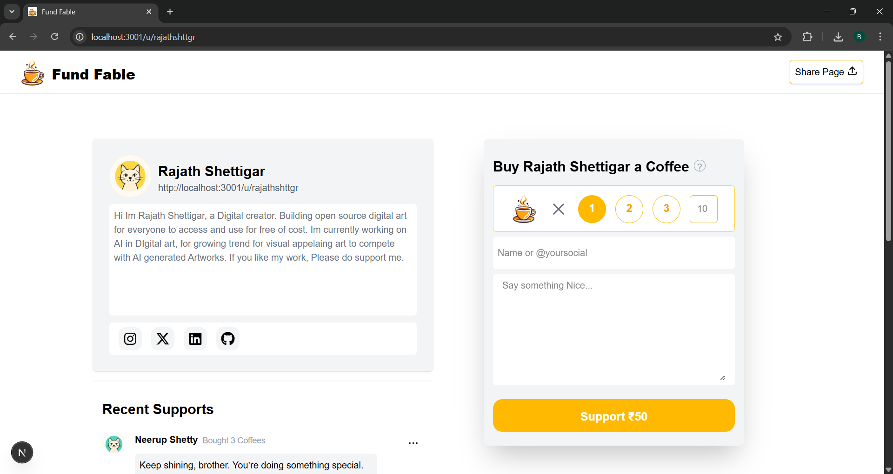

# FundFable

FundFable - A Creator Funding Platform

FundFable is a platform that allows people to support content creators by buying them a Coffee. It’s a way for creators to earn money from their work.

## Learn More About the System Design

For an in-depth article about the system design of this project, check out the Medium post: [System Design - FundFable](https://medium.com/@rajathshttgr/system-design-fundfable-6c27a0de39f4)

## Screenshots

### Creator Dashboard


### Creator Page



## Steps to Clone, Install, and Run the App

### 1. Clone the Repository

First, clone the repository to your local machine:

```bash
git clone https://github.com/rajathshttgr/fundfable.git
```

### 2. Navigate into the Project Directory

Change into the project directory:

```bash
cd FundFable/frontend
```

### 3. Install Dependencies

Install the required dependencies by running the following command:

```bash
npm install
```

### 4. Run the Application

Once the dependencies are installed, you can start the development server:

```bash
npm run dev
```

Open your browser and visit `http://localhost:3000/` to view the app.
